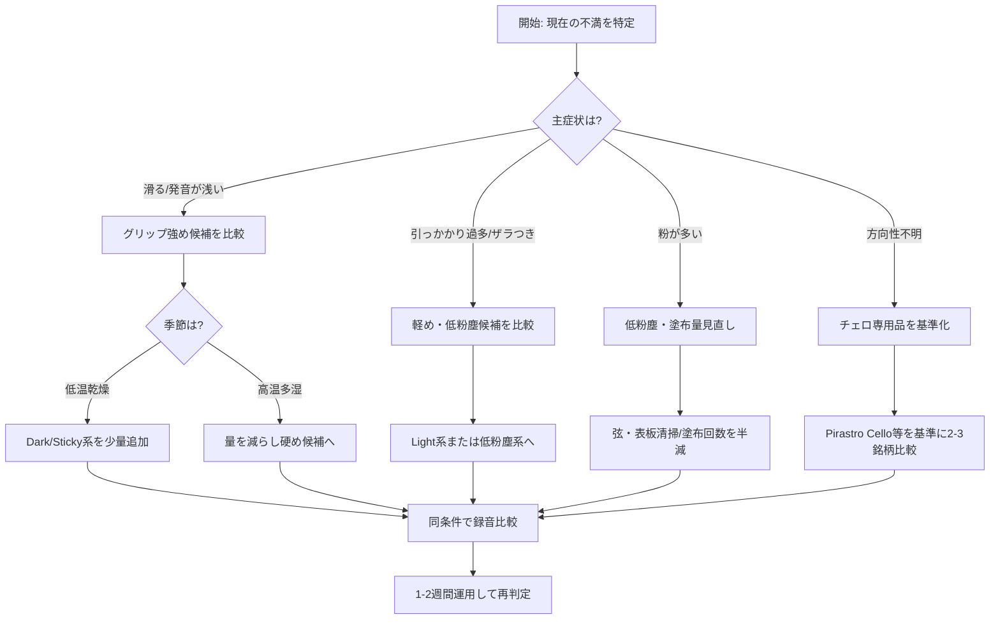

## 概要

このページは、チェロ演奏者が松脂を比較検討しやすくするための実務的な参照ページです。  
松脂は弓毛と弦の摩擦条件を調整する消耗品であり、**銘柄だけで結果を断定しにくい**（弓毛状態、弦、楽器、湿度、奏法の影響が大きい）点を前提に整理します。

また、配合や製法は企業秘密である場合が多く、公開情報は限定的です。未公表事項は未公表と明示し、販売店情報と公式情報を分けて扱います。

## 用語整理（松脂 / ロジン / コロホニー）

- **松脂（まつやに）**: 日本語の一般名称。弓用製品文脈では完成品（ケース入り松脂）を指すことが多いです。  
- **ロジン（Rosin）**: 英語圏での一般名称。弓用製品名にもそのまま使われます。  
- **コロホニー（Colophony / Kolophonium）**: 化学・材料文脈で使われる名称。弓用松脂でも欧州言語で表記されることがあります。

本ページでは、読者の実用性を優先して「松脂」を主表記とし、製品名や公式表記は原語を併記します。

## 原料・配合・製法（公開範囲）

- 多くの弓用松脂は、樹脂成分をベースに、硬さや粘着特性を調整した配合で作られます。  
- ただし、**具体的配合比・添加素材の詳細は未公表**である製品が多数です。  
- 「金属粉配合」「低粉塵」「低アレルギー」などの表現は、以下のように区別して読みます。

| 情報種別 | 例 | このページでの扱い |
|---|---|---|
| 公式情報 | メーカー公式サイトの製品説明 | 主要根拠として採用 |
| 販売店情報 | EC 商品説明・代理店説明 | 販売店情報ベースとして明示 |
| 一般評判 | レビュー・口コミ | 断定せず補助情報として扱う |

## 硬さ・温湿度・色の関係

- 色（Light / Dark）は参考情報にはなりますが、**主分類としては不十分**です。  
- 一般には「明色=硬め、濃色=柔らかめ」と言われますが、同名でも配合・対象楽器・ロットで印象差が出ます。  
- 実運用では、色よりも「温湿度条件での反応（滑り/引っかかり/粉）」を優先して評価するほうが再現性があります。

## 選定フローチャート（チェロ向け）

## 製品比較（チェロ向け）

> 注記: 「公式情報」はメーカー側の明示事項、「販売店情報ベース」は販売ページ中心の情報です。配合詳細は未公表が多いため、断定的な音質表現は避けています。

### 1) チェロ向け（専用設計を優先）

| 製品/ライン | 区分 | 情報種別 | 技術的メモ | 実務上の見方 |
|---|---|---|---|---|
| Pirastro Cellisto | チェロ向け | 公式情報あり | Pirastro のチェロ用ライン。詳細配合は未公表。 | Pirastro Cello との比較で硬さ方向を確認しやすい。 |
| Pirastro Cello | チェロ向け | 公式情報あり | 同社チェロ用の基準候補。詳細配合は未公表。 | 基準銘柄として他製品比較に使いやすい。 |
| Pirastro Oliv / Evah Pirazzi Rosin | 汎用〜チェロ使用例あり | 公式情報あり | 製品ライン名は公式掲載。チェロ専用表記は要追加確認。 | 低粉塵・反応の比較対象として運用可能だが用途確認が必要。 |
| Kolstein Supreme Cello | チェロ向け | 公式情報あり | チェロ用として展開。配合詳細は未公表。 | 専用品群の比較軸に入れやすい。 |
| Melos Cello Light | チェロ向け | 公式情報あり | Light/Dark/Sticky/Baroque の系統展開。 | 高温期や軽い反応を狙う比較候補。 |
| Melos Cello Dark | チェロ向け | 公式情報あり | 上記と同ライン。 | 低温期やグリップ重視時の候補。 |
| Melos Cello Sticky | チェロ向け | 公式情報あり | 同ライン内で強いグリップ方向。 | 滑りが続く場合の追加候補。塗布過多に注意。 |
| Melos Cello Baroque | チェロ向け（用途限定） | 公式情報あり | Baroque 用途名義の派生系。 | 通常運用に加える前に用途適合を要確認。 |
| Petz Cello | チェロ向け | 公式情報あり | Petz のチェロ表記モデル。 | 型番/包装差があるため購入時に Cello 表記を確認。 |
| Petz Soloist | チェロ使用例あり | 販売店情報ベース | Soloist 名称は流通で確認、チェロ専用かは要追加確認。 | 比較候補にはなるが用途断定は避ける。 |
| Petz Vienna’s Best | 汎用系 | 販売店情報ベース | Vienna’s Best は流通記載中心。 | チェロページでは補助候補として扱う。 |
| Nyman Cello | チェロ向け | 販売店情報ベース | Cello 表記で流通。公式仕様詳細は要追加確認。 | 実売実績は多いが最新仕様の一次確認を推奨。 |
| Hill Premium Dark Cello | チェロ向け | 販売店情報ベース | Premium Dark Cello 名義は販売情報で確認。 | 代理店/販売店記載差異を要確認。 |

### 2) 汎用・低粉塵・代替系

| 製品/ライン | 区分 | 情報種別 | 技術的メモ | 実務上の見方 |
|---|---|---|---|---|
| Bernardel | 汎用 | 販売店情報ベース | Vn/Va/Vc 対応として流通。 | 軽め方向の比較起点として使われやすい。 |
| Jade L’Opera | 汎用・低粉塵系 | 販売店情報ベース | 低粉塵傾向は販売説明で流通。 | 粉対策の候補。グリップ量は別途確認。 |
| Kaplan Premium Light | 汎用 | 公式情報あり | Light/Dark 展開。 | 引っかかり過多時の比較候補。 |
| Kaplan Premium Dark | 汎用 | 公式情報あり | 同上。 | 滑り対策側の比較候補。 |
| D’Addario Clarity Hypoallergenic | 代替系（低アレルギー訴求） | 公式情報あり | 低アレルギー訴求ライン。配合詳細は未公表。 | 皮膚刺激懸念時の候補。音色方向は要試奏確認。 |
| Archet Etude | 汎用 | 公式情報/販売情報併用 | Etude/Tenor 系列で展開。 | 基準比較を増やす用途で扱いやすい。 |
| Archet Tenor | チェロ寄り候補 | 公式情報/販売情報併用 | Tenor 名称で流通。用途詳細は要追加確認。 | グリップ方向比較で採用しやすい。 |

### 3) 高級・音色調整・特殊配合

| 製品/ライン | 区分 | 情報種別 | 技術的メモ | 実務上の見方 |
|---|---|---|---|---|
| Leatherwood Supple | 高級・調整系 | 公式情報あり | Supple/Crisp/Bespoke で設計思想を分ける。 | 柔軟側の反応調整候補。 |
| Leatherwood Crisp | 高級・調整系 | 公式情報あり | 同上。 | 明瞭側の反応調整候補。 |
| Leatherwood Bespoke | 高級・調整系 | 公式情報あり | カスタム思想。詳細処方は未公表。 | 基準松脂確定後に導入すると比較しやすい。 |
| Larica metal rosin | 特殊配合 | 公式情報あり | 金属系名称（Gold/Copper/Meteor Iron 等）を持つ。 | 系列間差が大きく、型番単位比較が前提。 |
| Cecilia Signature | 高級系 | 販売店情報ベース | Signature/Solo/Sanctus の流通表記あり。 | 公式一次情報の追加確認を推奨。 |
| Cecilia Solo | 高級系 | 販売店情報ベース | 同上。 | 用途断定を避け、同条件比較で判断。 |
| Cecilia Sanctus | 高級系 | 販売店情報ベース | 同上。 | 銘柄名先行でなく反応差で評価する。 |

## 弦・楽器別の見方

- **合成心材弦**: 反応と音色のバランスを狙う設計が多く、松脂の差が現れやすい一方で過多塗布時のザラつきも出やすいです。  
- **スチール弦**: 立ち上がりは得やすい反面、松脂過多で硬さ・ノイズ感が出る場合があります。  
- **ガット弦**: 立ち上がり安定のためにグリップ寄りが有利な場面がありますが、湿度依存が大きく一律化できません。

楽器個体（箱鳴り、反応速度、低音の太さ）と弓毛状態で最適点が変わるため、銘柄名だけでなく塗布量と接点設定を同時に調整します。

## 塗り方・量・トラブルシュート

- 新しい松脂に変える際は、旧松脂を弦と弓毛表面から可能な範囲で除去してから開始します。  
- 初期量の目安は「少なめから開始し、必要時のみ追加」です。  
- 滑る場合は、塗布前に弓毛の消耗と弦寿命も点検します（松脂のみが原因とは限らない）。

| 症状 | まず確認 | 次の対処 |
|---|---|---|
| 滑る/発音が浅い | 弓毛劣化、塗布不足、低温乾燥 | グリップ寄り銘柄を少量追加 |
| 引っかかり過多 | 塗布過多、湿度上昇、弦表面付着 | 清掃して塗布回数を減らす |
| 粉が多い | 塗布量、塗布圧、製品特性 | 低粉塵系へ移行して再比較 |
| 雑音が増えた | 弦の汚れ、弓毛偏摩耗 | セットアップ点検・再毛替え相談 |

## 安全・アレルギー・保管

- 松脂粉末は皮膚・呼吸器刺激となる場合があるため、演奏後に弦・表板・指板周辺を清掃し、粉を滞留させない運用を推奨します。  
- 皮膚刺激の既往がある場合は、低アレルギー訴求製品（例: Clarity 系）を比較候補に入れ、必要に応じて医療専門職へ相談してください。  
- 高温車内放置や直射日光は避け、割れ・軟化を防ぐためケース保管を基本とします。

## 比較・試奏の方法（再現性重視）

1. **基準銘柄を1つ固定**する（例: Pirastro Cello）。  
2. 1回の比較は 2〜3 銘柄に制限し、同じ曲・同じ弓・同じ場所で実施。  
3. C線/G線の発音、弱音立ち上がり、長弓の安定、粉量をチェック項目化。  
4. スマートフォンでもよいので同位置録音し、翌日に再評価。  
5. 気温・湿度をメモし、季節差を別記録にする。

## 短い歴史メモ

弓用松脂は、伝統的な樹脂利用を基礎に、近現代で用途別（Vn/Va/Vc、Light/Dark、低粉塵、高級調整系）へ細分化してきました。近年は「低粉塵」「低アレルギー」「配合カスタム」を訴求する製品が増えていますが、処方の全面公開は一般的ではありません。

## 参考リンク

- [Pirastro Rosin](https://www.pirastro.com/public_pirastro/pages/en/Rosin/)
- [Kolstein's Rosin](https://kolstein.com/pages/kolsteins-rosin)
- [Melos Rosin](https://melosrosin.gr/)
- [Petz Kolophonium](https://www.petzkolophonium.com/)
- [D'Addario Kaplan Premium Rosin](https://www.daddario.com/products/orchestral/rosin/kaplan-premium-rosin/)
- [D'Addario Clarity Hypoallergenic Rosin](https://www.daddario.com/products/orchestral/rosin/clarity-hypoallergenic-rosin/)
- [Leatherwood Bespoke Rosin](https://www.leatherwoodbespokerosin.com/)
- [Larica Rosin](https://www.larica.ch/en/about/index.html)
- [Archet Rosin](https://shop.archet.co.jp/)
- [Jade L'Opera Rosin（販売店情報例）](https://www.johnsonstring.com/cgi-bin/music/scripts/violin-viola-cello-jade-rosin.htm)
- [Bernardel Rosin（販売店情報例）](https://www.johnsonstring.com/cgi-bin/music/scripts/violin-viola-cello-bernardel-rosin.htm)
- [Hill Premium Dark Cello（販売店情報例）](https://www.sharmusic.com/products/hill-dark-cello-rosin)
- [Nyman Cello（販売店情報例）](https://www.concordmusic.com/products/nyman-cello-rosin)
- [Cecilia Rosin（販売店情報例）](https://www.concordmusic.com/collections/cecilia-rosin)
